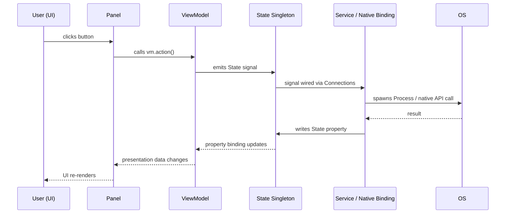
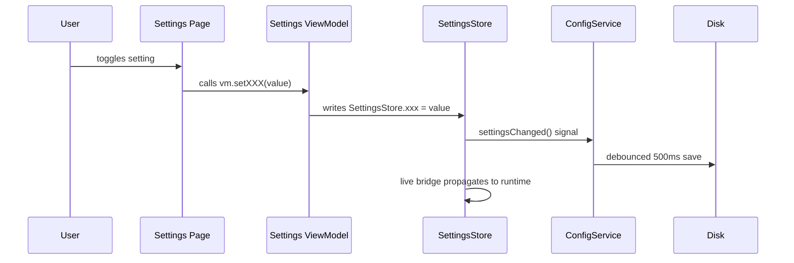
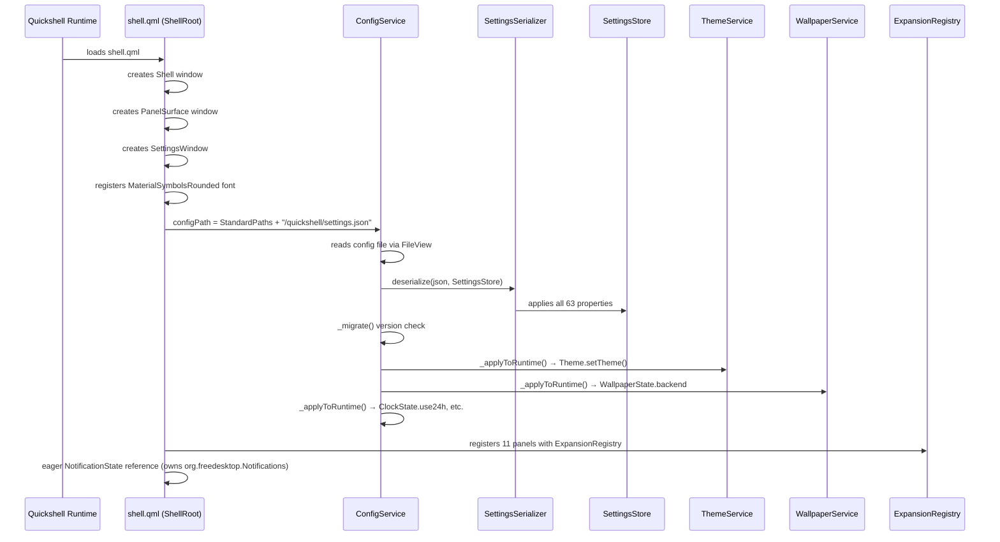
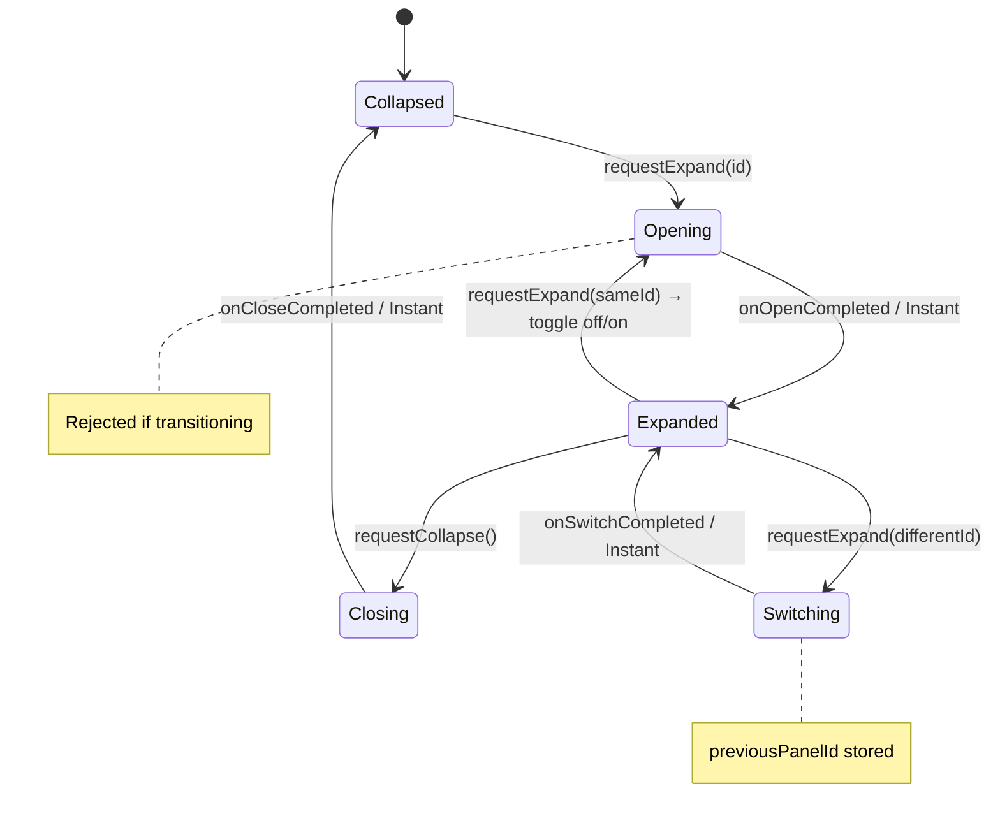
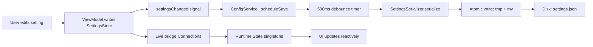
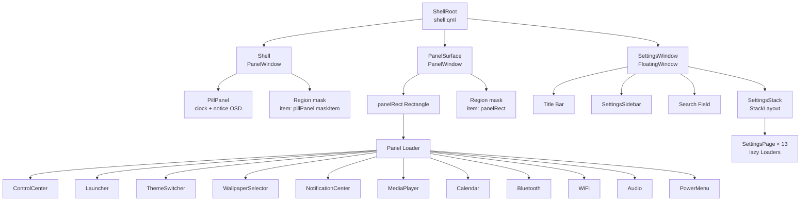

# Architecture

> Quickshell desktop shell for Hyprland — architectural overview derived from the implemented codebase.

---

## Overview

The shell is a Quickshell application with **exactly three top-level windows**:

| Window | Type | Purpose |
|---|---|---|
| **Shell** | `PanelWindow` | Full-width transparent top strip containing the floating pill bar. Owns a permanent strut. |
| **PanelSurface** | `PanelWindow` | Full-width transparent top strip that hosts the expanded panel. Floats above tiling windows, never unmaps. |
| **SettingsWindow** | `FloatingWindow` | Rounded, transparent window with sidebar + 13 content pages. |

No `PopupWindow` instances exist. `LockScreen.qml` (a `WlSessionLock` + PAM screen) is registered in `windows/qmldir` but is **not instantiated** by `shell.qml` — it is an unwired WIP. The "lock" IPC action runs `hyprlock` instead.

The pill bar and the expanded panel are **separate windows** (two-window split):

- `Shell` reserves a constant strut (`exclusionMode: Normal`), so tiling windows are always pushed below the pill and never overlap it.
- `PanelSurface` reserves nothing (`exclusionMode: Ignore`, `aboveWindows: true`), so an open panel floats over tiling windows without moving them.
- Collapse is expressed in QML (the panel rect springs to height 0 and the mask empties), never by unmapping the surface.

---

## Module Hierarchy

```
shell/
├── shell.qml              ← ShellRoot entry point
├── tokens/                ← FROZEN design system (7 singletons + 13 palettes)
├── metrics/               ← ShellMetrics (layout dimensions, live from SettingsStore)
├── motion/                ← MotionConfig (runtime animation override)
├── state/                 ← 16 reactive State singletons
├── services/              ← 5 Service singletons (OS IPC)
├── viewmodels/            ← 22 ViewModels (presentation adapters)
├── components/
│   ├── PillPanel.qml      ← the collapsed pill bar itself
│   ├── atoms/             ← 10 atoms (FROZEN primitive components)
│   └── molecules/         ← 18 molecules (FROZEN composite components)
├── panels/                ← 11 panels (pure views)
├── settings/              ← 20 settings components + SettingsStore + SettingsSerializer
├── windows/               ← Shell + PanelSurface + SettingsWindow (+ LockScreen WIP)
└── keybinds/              ← IpcHandler
```

---

## Dependency Graph

```mermaid
graph TD
    subgraph "UI Layer"
        Panels[panels/]
        SettingsPages[settings/ pages]
        ShellWin[windows/Shell]
        PanelSurf[windows/PanelSurface]
        SettingsWin[windows/SettingsWindow]
    end

    subgraph "Presentation Layer"
        VMs[viewmodels/]
    end

    subgraph "State Layer"
        States[state/]
        Store[SettingsStore]
    end

    subgraph "Service Layer"
        Svc[services/]
    end

    subgraph "Design System (FROZEN)"
        Tokens[tokens/]
        Atoms[atoms/]
        Molecules[molecules/]
    end

    subgraph "Layout"
        Metrics[metrics/ShellMetrics]
    end

    subgraph "Motion"
        Motion[motion/MotionConfig]
    end

    Panels --> VMs
    Panels --> Tokens
    Panels --> Metrics
    Panels --> Atoms
    Panels --> Molecules

    SettingsPages --> VMs
    SettingsPages --> Tokens
    SettingsPages --> Metrics
    SettingsPages --> Atoms
    SettingsPages --> Molecules
    SettingsPages --> Store

    VMs --> States
    VMs --> Store
    VMs --> Tokens

    ShellWin --> Tokens
    ShellWin --> Metrics
    ShellWin --> States
    ShellWin --> Motion

    PanelSurf --> Tokens
    PanelSurf --> Metrics
    PanelSurf --> States
    PanelSurf --> Motion

    SettingsWin --> Tokens
    SettingsWin --> Metrics
    SettingsWin --> States

    Metrics --> Store
    Metrics --> Tokens

    Svc --> States
    Svc --> Store
    Svc --> Tokens

    Store --> Svc
    Motion --> Store

    style Tokens fill:#2d4a3e,stroke:#7ad9a8,color:#f5e2c5
    style Atoms fill:#2d4a3e,stroke:#7ad9a8,color:#f5e2c5
    style Molecules fill:#2d4a3e,stroke:#7ad9a8,color:#f5e2c5
```

### Hard Rules

| Rule | Status | Description |
|---|---|---|
| **Panels never import Services** | ✅ | Zero `import qs.services` in panels/ |
| **Panels never use Process** | ✅ | Zero `Process {}` in panels/ |
| **Panels never import State** | ⚠️ | Bluetooth, MediaPlayer, WiFi import `qs.state` for `ExpansionManager` (Escape collapse) and `ClockState` (MediaPlayer date display) |
| **Settings pages never import Services** | ✅ | Zero `import qs.services` in settings/ page components |
| **Settings ViewModels only read SettingsStore** | ⚠️ | Except AppearanceViewModel (ThemeState, WallpaperState) and SystemSettingsViewModel (PowerState) |
| **Atoms/Molecules are FROZEN** | ✅ | Never modify — only consume |
| **Tokens are FROZEN** | ✅ | Never modify the design system |

---

## MVVM Flow

The shell is MVVM: panels and settings pages are views, viewmodels format data, state singletons hold runtime truth, and services (or native Quickshell bindings) talk to the OS.



Most hardware state (audio, battery, bluetooth, network, media, notifications, launcher, clock) is bound directly to native Quickshell services inside the state singletons — no Process involved. Only brightness, wallpaper, theme, power, and config still go through services.

### Settings MVVM (different flow)



---

## Runtime Flow

### Startup Sequence



### Panel Expansion Flow



---

## Settings Persistence Flow



### Atomic Write Pattern

```
echo '{json}' > '/path/settings.json.tmp' && mv '/path/settings.json.tmp' '/path/settings.json'
```

- Write to `.tmp` file first
- Rename atomically via `mv`
- No partial writes on crash

---

## Window Hierarchy



---

## Z-Ordering

With the two-window split, stacking is decided by the compositor between layer surfaces, not by QML z values:

| Layer | Window | Notes |
|---|---|---|
| Strut | Shell | `exclusionMode: Normal` — pushes tiling windows below the pill |
| Pill | Shell | Masked to the pill pixels; transparent areas pass clicks through |
| Panel | PanelSurface | `aboveWindows: true` — floats over tiling windows |
| Settings | SettingsWindow | Floating window, moved by Hyprland |

Within the Shell window, the notice OSD (`noticeSurface`, z: 2) sits above the pill surface.

---

## Data Flow Diagram — Complete

```mermaid
flowchart TB
    subgraph "OS / External"
        BCTL[brightnessctl]
        AWWW[awww]
        HYPR[hyprctl]
        LOGINCTL[loginctl]
        SYSTEMCTL[systemctl]
        XDG[xdg-open]
        THEMESCRIPTS[theme-list / theme-switcher]
    end

    subgraph "Native Quickshell Services"
        PW[Pipewire]
        UP[UPower]
        BT[Bluetooth]
        NM[Networking]
        MPRIS[Mpris]
        NOTIF[Notifications]
        DE[DesktopEntries]
        SC[SystemClock]
    end

    subgraph "Services"
        BS[BrightnessService]
        WS2[WallpaperService]
        TS2[ThemeService]
        PS[PowerService]
        CS2[ConfigService]
    end

    subgraph "State"
        AUSt[AudioState]
        BRSt[BrightnessState]
        BASt[BatteryState]
        BTSt[BluetoothState]
        NESt[NetworkState]
        MESt[MediaState]
        WASt[WallpaperState]
        THSt[ThemeState]
        LASt[LauncherState]
        NOSt[NotificationState]
        CLSt[ClockState]
        POSt[PowerState]
        SESt[SettingsState]
        EXR[ExpansionRegistry]
        EXM[ExpansionManager]
        ICR[IconRegistry]
    end

    subgraph "Store"
        SST[SettingsStore<br/>63 properties]
    end

    BCTL --> BS --> BRSt
    AWWW --> WS2 --> WASt
    THEMESCRIPTS --> TS2 --> THSt
    LOGINCTL --> PS --> POSt
    SYSTEMCTL --> PS
    XDG --> PS
    CS2 --> SST

    PW --> AUSt
    UP --> BASt
    BT --> BTSt
    NM --> NESt
    MPRIS --> MESt
    NOTIF --> NOSt
    DE --> LASt
    SC --> CLSt

    SST --> CS2
    SST -.-> |live bridge| THSt
    SST -.-> |live bridge| WASt
    SST -.-> |live bridge| CLSt
    SST -.-> |live bridge| HYPR
```



The dashed lines represent the live bridge in `shell.qml` that propagates SettingsStore changes to runtime State singletons and Hyprland keybinds immediately when the user edits settings.