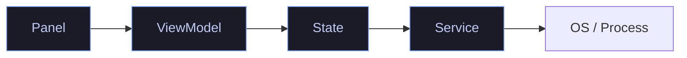

# Contributing

> Developer conventions and rules for the Quickshell desktop shell.

---

## Folder Structure

```
shell/
├── tokens/          # FROZEN design system — do not modify
├── metrics/         # Layout dimensions (ShellMetrics)
├── motion/          # Runtime animation override (MotionConfig)
├── state/           # Reactive State singletons (16, incl. IconRegistry)
├── services/        # Service components (OS IPC — exactly 5)
├── viewmodels/      # Presentation adapters
├── components/
│   ├── atoms/       # FROZEN primitive components — do not modify
│   ├── molecules/   # FROZEN composite components — do not modify
│   └── PillPanel.qml
├── panels/          # Expandable panel views (11)
├── settings/        # Settings navigation + SettingsStore + SettingsSerializer
├── windows/         # Shell, PanelSurface, SettingsWindow, LockScreen (WIP)
└── keybinds/        # IpcHandler
```

Module import URIs:

```
qs.tokens, qs.metrics, qs.motion, qs.state, qs.services,
qs.viewmodels, qs.components (+ qs.components.atoms, qs.components.molecules),
qs.panels, qs.settings, qs.windows, qs.keybinds
```

Notes:

- `tokens/Motion.qml` is the FROZEN motion token bank. Runtime animation overrides live in `motion/MotionConfig.qml` — that is the sanctioned place to read animation settings (`MotionConfig.duration()`, `MotionConfig.spring`).
- `windows/` has four files, but `shell.qml` instantiates exactly three windows: `Shell` (pill bar), `PanelSurface` (floating expanded panel), `SettingsWindow` (FloatingWindow). `LockScreen.qml` (WlSessionLock + PAM) is a work in progress and is NOT wired into `shell.qml` yet.
- `services/` contains exactly five components: `BrightnessService`, `ConfigService`, `PowerService`, `ThemeService`, `WallpaperService`. Audio, battery, bluetooth, network, media, launcher, notification, and clock state are provided by native Quickshell bindings inside the `state/` singletons (`Quickshell.Services.Pipewire`, `Quickshell.Services.UPower`, `Quickshell.Bluetooth`, `Quickshell.Networking`, `Quickshell.Services.Mpris`, `Quickshell.Services.Notifications`).

---

## Naming Conventions

| Element | Convention | Example |
|---|---|---|
| QML files | PascalCase | `ControlCenter.qml` |
| Singleton QML files | PascalCase | `AudioState.qml` |
| QML ids | camelCase | `pillPanel`, `contentColumn` |
| Property names | camelCase | `pillWidth`, `isExpanded` |
| Signal names | camelCase + past participle | `settingsChanged()`, `volumeRequested()` |
| Function names | camelCase, verb-first | `setTheme()`, `requestExpand()` |
| Panel IDs | kebab-case | `"control-center"`, `"theme-switcher"` |
| SettingsStore keys | camelCase | `keybindLauncher`, `ccShowVolume` |
| Theme keys | kebab-case | `"tokyo-night"`, `"catppuccin-mocha"` |
| Module names | PascalCase | `Tokens`, `State`, `Viewmodels` |
| Import URIs | `qs.` + lowercase | `qs.tokens`, `qs.state`, `qs.motion` |

---

## MVVM Rules

### Panel → ViewModel → State → Service → OS

This is the **hard dependency chain**. No layer may bypass another.



| Rule | Violation | Consequence |
|---|---|---|
| Panels never import `qs.services` | Panel spawns Process | Architecture break |
| Panels never import `qs.state` | Panel reads State directly | Bypasses ViewModel |
| Panels never use `Process {}` | Panel runs commands | Bypasses Service layer |
| ViewModels never import `qs.services` | VM spawns Process | Bypasses Service layer |
| Settings ViewModels read only `SettingsStore` | VM reads runtime State | Mixes config with runtime |
| Services never import other Services | Service-to-service call | Circular dependency risk |

### Exceptions

| Exception | Reason |
|---|---|
| `AppearanceViewModel` reads `ThemeState`, `WallpaperState` | Cross-cutting appearance data not in SettingsStore |
| `SystemSettingsViewModel` routes to `PowerState` | System management is action, not persisted setting |
| `AppearancePage` calls `SettingsState.navigate()` | UI navigation, not data flow |
| `ControlCenterViewModel` calls `ExpansionManager.requestExpand()` | Panel-to-panel navigation within the same layer |

---

## Singleton Rules

### When to Create a Singleton

1. **State singletons** — when you need reactive data shared across multiple ViewModels
2. **Service singletons** — never: services are plain QML components (`Type 0.1 File.qml` in `qmldir`), instantiated exactly once in `shell.qml`
3. **Design token singletons** — never (they're frozen)

### Singleton Registration Checklist

- [ ] Add `pragma Singleton` as first line of QML file
- [ ] Register in the module's `qmldir` with `singleton Name Path`
- [ ] Verify module name in `qmldir` matches import convention
- [ ] Verify no circular dependency with other singletons in the same module

### Singleton Import Pattern

```qml
// In consuming file:
import qs.state       // for State singletons
import qs.services    // for service components (shell.qml only)
import qs.settings    // for SettingsStore, SettingsSerializer
```

---

## When to Create Atoms

Atoms are **frozen** — do not create new atoms without a design review. The criteria for an atom:

- **Leaf component** — composes only QtQuick primitives (Text, Rectangle, MouseArea)
- **No domain knowledge** — reusable across any shell, not specific to this shell
- **Token-driven** — all dimensions/colors from the token system
- **Minimal API** — 3–5 properties maximum

If your component doesn't meet all criteria, create a **molecule** instead.

---

## When to Create Molecules

Molecules are **frozen** — do not create new molecules without a design review. The criteria:

- **Composes atoms** — built from ShellIcon, ShellText, ShellButton, etc.
- **Domain-specific** — encodes a UI pattern (e.g., "setting row with toggle")
- **Token-driven** — all spacing/sizing from tokens
- **Stable API** — once frozen, the public API never changes

If your component is specific to one panel or page, inline it in that panel/page instead.

---

## When to Create ViewModels

Create a ViewModel when:

1. **A panel needs formatted/derived data** from State that isn't raw State properties
2. **A settings page needs to bridge** between SettingsStore and the UI
3. **Presentation logic** (formatting, sorting, filtering) would otherwise live in the view

### ViewModel Naming

| Type | Naming Pattern | Example |
|---|---|---|
| Panel ViewModel | `PanelNameViewModel` | `ControlCenterViewModel` |
| Settings ViewModel | `PageNameSettingsViewModel` | `ClockDateSettingsViewModel` |

### ViewModel Structure

```qml
import QtQuick
import qs.settings  // for settings VMs
// OR
import qs.state     // for panel VMs

QtObject {
    id: vm

    // ── Read-only presentation properties ──
    readonly property string displayValue: SomeState.rawValue + " suffix"

    // ── Actions (write to State or SettingsStore) ──
    function setSomething(val) { SomeStore.property = val }
}
```

---

## Coding Standards

### Imports

Order imports consistently:

```qml
import QtQuick                    // Qt first
import Quickshell                 // Quickshell second
import Quickshell.Io              // Quickshell sub-modules

import qs.components              // Our modules (alphabetical)
import qs.components.atoms
import qs.components.molecules
import qs.keybinds
import qs.metrics
import qs.motion
import qs.panels
import qs.services
import qs.settings
import qs.state
import qs.tokens
import qs.viewmodels
import qs.windows
```

Never import modules you don't use.

### Property Declarations

- Use `readonly property` for derived values bound to other properties
- Use `property` only for values that may be set externally
- Always specify a default value
- Group properties by category with section comments

### Signal/Slot Pattern

```qml
// State defines the signal:
signal setVolumeRequested(real volume)

// Service connects via Connections:
Connections {
    target: AudioState
    function onSetVolumeRequested(vol) { /* execute */ }
}

// ViewModel calls the signal:
function setVolume(val) { AudioState.setVolumeRequested(val) }

// UI calls the ViewModel:
onMoved: vm.setVolume(newValue)
```

### Layout

- Use `anchors` for positioning within a parent
- Never mix `anchors` and `Layout` attached properties in the same item
- Use `Column`/`Row` for linear layouts, `Flow` for wrapping grids
- Use `Flickable` for scrollable content in settings pages
- All dimensions from `ShellMetrics` or `Spacing` tokens — never hardcode

---

## Token Usage Rules

| Rule | Example |
|---|---|
| Never hardcode colors | ✅ `color: Colors.accent` ❌ `color: "#7aa2f7"` |
| Never hardcode spacing | ✅ `spacing: Spacing.md` ❌ `spacing: 12` |
| Never hardcode radii | ✅ `radius: Radius.panel.background` ❌ `radius: 16` |
| Never hardcode font sizes | ✅ `font.pixelSize: Typography.body.size` ❌ `font.pixelSize: 14` |
| Never hardcode animation durations | ✅ `duration: MotionConfig.duration(Motion.duration.fast)` ❌ `duration: 100` |
| Exception: ShellMetrics.qml | May define shell-specific values with inline comments |
| Exception: SettingsStore defaults | May contain numeric defaults matching token values |

Motion rules:

- `tokens/Motion.qml` is FROZEN. Read durations/easings from `Motion.duration.*`, `Motion.easing.*`, `Motion.spring.*` directly.
- Non-frozen animation must consume runtime settings through `motion/MotionConfig.qml`: `MotionConfig.duration(ms)` (honors `animationSpeed` and `animationsEnabled`), `MotionConfig.spring` (honors `springStiffness`/`springDamping`), `MotionConfig.animationsEnabled`.
- Never read `SettingsStore` animation keys in components; that is `MotionConfig`'s job.
