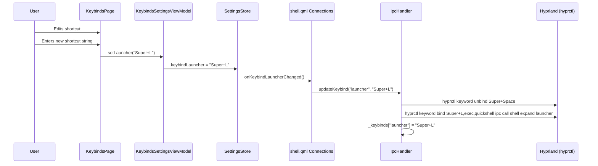

# Keybinds

> Keybind system architecture, IPC routing, and dynamic rebinding.

---

## Default Shortcuts

Current binds as registered in `~/.config/hypr/modules/binds.lua`:

| Shortcut | Panel/Action | SettingsStore Property |
|---|---|---|
| `Super+Space` | Launcher | `keybindLauncher` |
| `Super+T` | Theme Switcher | `keybindThemeSwitcher` |
| `Super+W` | Wallpaper Selector (theme scope) | `keybindWallpaperSelector` |
| `Super+I` | Control Center | (hardcoded in binds.lua) |
| `Super+Shift+I` | Wallpaper Selector (all scope) | (hardcoded in binds.lua) |
| `Super+N` | Notification Center | `keybindNotificationCenter` |
| `Super+M` | Media Player | `keybindMedia` |
| `Super+Shift+M` | Lock (hyprlock) | (hardcoded in binds.lua) |
| `Super+Comma` | Settings (toggle) | `keybindSettings` |
| `Super+Escape` | Collapse active panel | (hardcoded in binds.lua) |
| `Escape` | Collapse active panel | (in-shell Shortcut, not configurable) |

The wallpaper commands use `expandWallpapers` (`theme` or `all` scope) rather than plain `expand`.

---

## Configurable Shortcuts

The six settings-backed shortcuts are configurable via the **Keybinds** settings page. Changes take effect immediately via hyprctl — no shell reload needed.

### Change Flow



---

## IPC Routing

### Hyprland → Shell

Keybinds are registered in `binds.lua` (`~/.config/hypr/modules/`):

```
Super+Space     → quickshell ipc call shell expand launcher
Super+T         → quickshell ipc call shell expand theme-switcher
Super+W         → quickshell ipc call shell expandWallpapers theme
Super+I         → quickshell ipc call shell expand control-center
Super+Shift+I   → quickshell ipc call shell expandWallpapers all
Super+N         → quickshell ipc call shell expand notification-center
Super+M         → quickshell ipc call shell expand media-player
Super+Shift+M   → quickshell ipc call shell lock
Super+Comma     → quickshell ipc call shell settingsToggle
Super+Escape    → quickshell ipc call shell collapse
```

Quickshell receives these as IPC calls on the `shell` target and routes them through `IpcHandler` (`keybinds/IpcHandler.qml`).

### IpcHandler Methods

| Method | Dispatch Target |
|---|---|
| `expand(panelId)` | `ExpansionManager.requestExpand(panelId)` |
| `collapse()` | `ExpansionManager.requestCollapse()` |
| `lock()` | `sh -c "pidof hyprlock >/dev/null \|\| exec hyprlock"` (via `Quickshell.execDetached`) |
| `expandWallpapers(scope)` | Sets `WallpaperState.scope` (`"theme"` or `"all"`), then `requestExpand("wallpaper-selector")` |
| `settingsOpen(pageId)` | `SettingsState.open(pageId || "appearance")` |
| `settingsClose()` | `SettingsState.close()` |
| `settingsToggle()` | `SettingsState.toggle()` |
| `themeNext()` | `ThemeState.nextRequested()` |
| `themePrevious()` | `ThemeState.previousRequested()` |
| `updateKeybind(panelId, newShortcut)` | `hyprctl keyword unbind/bind` |

All IPC function signatures must have explicit type annotations or Quickshell will not register them.

### Dynamic Keybind Registration

`IpcHandler.updateKeybind(panelId, newShortcut)` unbinds the old shortcut and binds the new one via hyprctl. The IPC command depends on the panel: `"settings"` maps to `settingsToggle`, every other panel maps to `expand <panelId>`:

```qml
function updateKeybind(panelId: string, newShortcut: string): void {
    var oldShortcut = _keybinds[panelId]
    if (oldShortcut === newShortcut) return

    // Build the IPC command for this panel
    var ipcCmd
    if (panelId === "settings") {
        ipcCmd = "quickshell ipc call shell settingsToggle"
    } else {
        ipcCmd = "quickshell ipc call shell expand " + panelId
    }

    // Unbind old (if non-empty)
    if (oldShortcut && oldShortcut !== "") {
        hyprctlUnbind.command = ["hyprctl", "keyword", "unbind", oldShortcut]
        hyprctlUnbind.running = true
    }

    // Bind new
    if (newShortcut && newShortcut !== "") {
        hyprctlBind.command = ["hyprctl", "keyword", "bind", newShortcut + ",exec," + ipcCmd]
        hyprctlBind.running = true
    }

    // Update internal map
    var copy = Object.assign({}, _keybinds)
    copy[panelId] = newShortcut
    _keybinds = copy
}
```

The active keybind map `_keybinds` (panelId → shortcut string) lives on the root `Item` because `IpcHandler` wraps every property for IPC and QVariant maps cannot cross that boundary. It is initialized from `SettingsStore` and updated live by the Connections block in `shell.qml`.

---

## ExpansionManager Actions

| Action | Method | Valid Lifecycle States |
|---|---|---|
| Expand panel | `requestExpand(id)` | Collapsed, Expanded |
| Collapse panel | `requestCollapse()` | Expanded, Opening |
| Open completed | `onOpenCompleted()` | Opening |
| Close completed | `onCloseCompleted()` | Closing |
| Switch completed | `onSwitchCompleted()` | Switching |

Invalid transitions (e.g., `requestExpand` during `Opening`) are rejected with a console warning and treated as no-ops.

---

## Hyprland Integration

### Window Rules

```
windowrule = float,   class:quickshell, title:Settings
windowrule = pinned,  class:quickshell, title:Settings
windowrule = size 576 432, class:quickshell, title:Settings
```

### Focus Grab

The shell uses `HyprlandFocusGrab` to detect when the user clicks outside the `PanelSurface` (the interactive window while a panel is expanded). Focus loss does not collapse immediately: a 50 ms timer lets a concurrent pill click (`requestExpand`) win the race. Collapse only fires if the lifecycle is still `Expanded`:

```qml
HyprlandFocusGrab {
    id: shellFocusGrab

    windows: [panelSurface]
    active: ExpansionManager.isExpanded

    onActiveChanged: {
        if (!active) {
            // Delay collapse slightly to avoid race with pill click.
            focusGrabCollapseTimer.start()
        }
    }
}

Timer {
    id: focusGrabCollapseTimer
    interval: 50
    onTriggered: {
        if (ExpansionManager.lifecycle === ExpansionManager.Lifecycle.Expanded) {
            ExpansionManager.requestCollapse()
        }
    }
}
```

### Config Snippet

`IpcHandler` exposes a `hyprlandConfigSnippet` property containing a reference keybind configuration for users to copy into `hyprland.conf`. It is a reference string only — it is never applied at runtime. The live source of truth is `binds.lua`, which additionally wires `Super+I` → control-center and `Super+Shift+M` → lock on top of the snippet:

```
# ─── Shell keybinds ───────────────────────────────
bind = SUPER, Space, exec, quickshell ipc call shell expand launcher
bind = SUPER, T,     exec, quickshell ipc call shell expand theme-switcher
bind = SUPER, W,     exec, quickshell ipc call shell expandWallpapers theme
bind = SUPER, SHIFT, I, exec, quickshell ipc call shell expandWallpapers all
bind = SUPER, N,     exec, quickshell ipc call shell expand notification-center
bind = SUPER, M,     exec, quickshell ipc call shell expand media-player
bind = SUPER, Escape,exec, quickshell ipc call shell collapse

# ─── Settings ──────────────────────────────────────
bind = SUPER, comma, exec, quickshell ipc call shell settingsToggle

# ─── Settings window rules ─────────────────────────
windowrule = float,   class:quickshell, title:Settings
windowrule = pinned,  class:quickshell, title:Settings
windowrule = size %1 %2, class:quickshell, title:Settings   # %1=width %2=height
```

The dynamic keybinds registered by `updateKeybind` override these at runtime.
