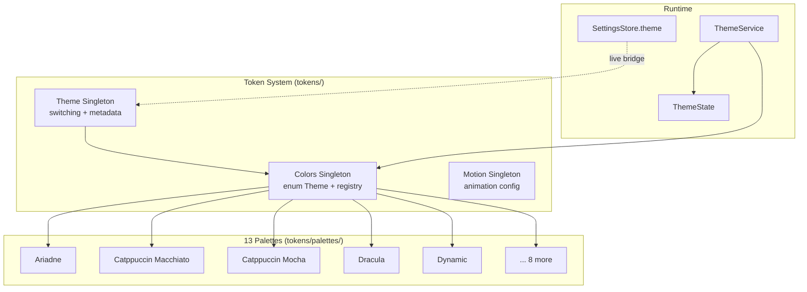
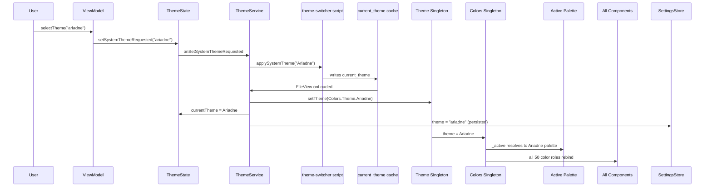

# Themes

> Theme system architecture, palette specification, and runtime flow.

---

## Architecture



---

## Colors Singleton

**File:** `tokens/Colors.qml`

The Colors singleton is the **single source of truth** for all color values in the shell. Every component references `Colors.fg`, `Colors.accent`, etc. — never palette singletons directly.

### Theme Enum

```qml
enum Theme {
    Ariadne,
    CatppuccinMacchiato,
    CatppuccinMocha,
    Dracula,
    Dynamic,
    Everforest,
    Gruvbox,
    Nightfox,
    Noir,
    Nord,
    RosePine,
    SolarizedDark,
    TokyoNight
}
```

### Active Theme

```qml
property int theme: Colors.Theme.TokyoNight
readonly property QtObject _active: _registry[theme].palette
```

`Colors.theme` is the active enum value. `_active` resolves to the owning palette singleton; every semantic color role delegates to it.

### setTheme(keyOrValue)

Accepts either an enum int (`Colors.Theme.Gruvbox`) or a lowercase string key (`"gruvbox"`, `"catppuccin-mocha"`, …). String keys resolve through `paletteForKey()` and the registry. Unknown keys log a warning and are ignored.

### Theme Registry

Maps enum values to palette singletons and string keys:

```qml
readonly property var _registry: ({
    [Colors.Theme.Ariadne]:           { palette: Ariadne,           key: "ariadne" },
    [Colors.Theme.CatppuccinMocha]:   { palette: CatppuccinMocha,   key: "catppuccin-mocha" },
    // ... 13 entries
})
```

### Available Themes List

Exposed for the Settings UI and the ThemeSwitcher panel:

```qml
readonly property var availableThemes: [
    { value: Colors.Theme.Ariadne,           key: "ariadne",            label: "Ariadne" },
    { value: Colors.Theme.CatppuccinMacchiato, key: "catppuccin-macchiato", label: "Catppuccin Macchiato" },
    { value: Colors.Theme.CatppuccinMocha,   key: "catppuccin-mocha",   label: "Catppuccin Mocha" },
    { value: Colors.Theme.Dracula,           key: "dracula",            label: "Dracula" },
    { value: Colors.Theme.Dynamic,           key: "dynamic",            label: "Dynamic" },
    { value: Colors.Theme.Everforest,        key: "everforest",         label: "Everforest" },
    { value: Colors.Theme.Gruvbox,           key: "gruvbox",            label: "Gruvbox" },
    { value: Colors.Theme.Nightfox,          key: "nightfox",           label: "Nightfox" },
    { value: Colors.Theme.Noir,              key: "noir",               label: "Noir" },
    { value: Colors.Theme.Nord,              key: "nord",               label: "Nord" },
    { value: Colors.Theme.RosePine,          key: "rose-pine",          label: "Rosé Pine" },
    { value: Colors.Theme.SolarizedDark,     key: "solarized-dark",     label: "Solarized Dark" },
    { value: Colors.Theme.TokyoNight,        key: "tokyo-night",        label: "Tokyo Night" }
]
```

The Rosé Pine entry is labeled `Rosé Pine` (with the accent) in `availableThemes`, while the palette file itself uses `name: "RosePine"`.

### paletteForKey(key)

Returns the palette singleton for a lowercase key, or null for an unknown key. ThemeSwitcher and Appearance viewmodels use it to preview each theme's real colors (bg/surface/accent) in cards.

### Semantic Color Roles

Colors exposes 50 `readonly property color` roles, each delegating to `_active.<same>`:

```qml
readonly property color bg:             _active.bg
readonly property color fg:             _active.fg
readonly property color accent:         _active.accent
// ... 50 roles total
```

Grouped as: backgrounds (4), foregrounds (6), accents (5), semantic success/warning/error/info (12), borders and dividers (4), pill (3), interactive controls (10), scrollbar (3), overlay (2), shadow (1).

---

## Theme Singleton

**File:** `tokens/Theme.qml`

Delegates to Colors as the source of truth; switching is a thin wrapper.

| Property/Method | Description |
|---|---|
| `current` | Active theme enum value (defaults to `Colors.Theme.TokyoNight`) |
| `setTheme(t)` | Set theme by enum value |
| `next()` | Cycle forward through `Colors.availableThemes` |
| `previous()` | Cycle backward through `Colors.availableThemes` |
| `key` | String key of the active theme (delegates to `Colors.key`) |
| `label` | Human-readable label (delegates to `Colors.label`) |
| `isDark` | Whether the active theme is dark |

**Side effect:** `onCurrentChanged` assigns `Colors.theme = current`, triggering the full palette cascade.

Theme also aggregates token references (colors, typography, spacing, radii, motion, elevation) as a single import point. The motion token is `tokens/Motion.qml`, referenced as `Theme.animation`.

---

## Motion Singleton

**File:** `tokens/Motion.qml`

The frozen animation configuration: duration scale (`instant` … `glacial`, `toast`), easing curves, spring presets (`default_`, `gentle`, `snappy`, `bouncy`, `stiff`), and semantic configs (panel, pill, button, toggle, slider, listItem, notification, theme, window, scroll) plus opacity values.

It is FROZEN and not writable. Runtime override of durations, springs, and the animation toggle lives in `motion/MotionConfig.qml`, which reads SettingsStore (`animationsEnabled`, `animationSpeed`, `springDamping`, `springStiffness`) and scales the Motion token values. Panel animators in `PanelSurface` consume `MotionConfig.duration(...)` and `MotionConfig.animationsEnabled`.

---

## Palette Specification

Each palette is a `pragma Singleton` `QtObject` in `tokens/palettes/`. It declares three metadata properties and 50 `property color` roles with the same names the Colors singleton delegates to:

```qml
pragma Singleton
import QtQuick

QtObject {
    readonly property string name: "Ariadne"
    readonly property string label: "Ariadne"
    readonly property bool isDark: true

    readonly property color bg:             "#0a1816"
    readonly property color fg:             "#f5e2c5"
    readonly property color accent:         "#7ad9a8"
    // ... 50 color roles
}
```

There is no separate M3 source-color layer inside the palettes. Each palette directly declares the same 50 semantic roles that Colors exposes, so Colors can delegate 1:1 (`_active.bg`, `_active.fg`, …).

### The 50 Semantic Color Roles

| Group | Roles |
|---|---|
| Backgrounds | `bg`, `surface`, `surfaceVariant`, `surfaceRaised` |
| Foregrounds | `fg`, `fgMuted`, `fgDisabled`, `fgOnAccent`, `fgOnSurface`, `fgOnWarning` |
| Accent | `accent`, `accentHover`, `accentPressed`, `accentMuted`, `accentSurface` |
| Semantic | `success`, `successMuted`, `successSurface`, `warning`, `warningMuted`, `warningSurface`, `error`, `errorMuted`, `errorSurface`, `info`, `infoMuted`, `infoSurface` |
| Borders | `border`, `borderStrong`, `borderFocus`, `divider` |
| Pill | `pillBg`, `pillFg`, `pillBorder` |
| Interactive | `hoverOverlay`, `pressedOverlay`, `selectedBg`, `toggleTrack`, `toggleActive`, `sliderTrack`, `sliderFill`, `inputBg`, `inputBorder`, `inputBorderFocus` |
| Scrollbar | `scrollbarTrack`, `scrollbarHandle`, `scrollbarHandleHover` |
| Overlay | `overlay`, `overlayStrong` |
| Shadow | `shadow` |

---

## Dynamic Theme

The `Dynamic` palette (`tokens/palettes/Dynamic.qml`) is seeded with Catppuccin Mocha fallback values. The file comment describes the intended pipeline: replace the hex values with output from wallust/pywal/material-color-utilities at runtime.

**Current state:** Dynamic is a static Catppuccin Mocha fallback. Runtime wallpaper-derived palette generation is not yet implemented. Selecting "Dynamic" applies the static fallback.

---

## Theme-Switcher Integration

The ThemeSwitcher panel and the Themes settings page both offer theme selection, and both route through `ThemeState.setSystemThemeRequested`.

### Panel (ThemeSwitcher)
1. User clicks a ThemeCard → `ThemeSwitcherViewModel.selectTheme(key)`
2. ViewModel emits `ThemeState.setSystemThemeRequested(key)`
3. `ThemeService` resolves the key to the real theme directory name (case-sensitive) and runs `theme-switcher` via `applySystemTheme()`, which applies the theme system-wide (Hyprland, GTK, waybar, rofi, ghostty, nvim, …)
4. `theme-switcher` writes `~/.cache/wallpaper/current_theme`; the FileView watcher mirrors it: `Theme.setTheme(value)` + `ThemeState.currentTheme` + `SettingsStore.theme = key` (persisted)

### Settings Page (ThemePage via AppearanceViewModel)
1. User clicks a ThemeCard → `AppearanceViewModel.selectTheme(key)`
2. Same route: `ThemeState.setSystemThemeRequested(key)` → ThemeService → theme-switcher → current_theme cache → Theme/Colors cascade
3. Persisted through the same `SettingsStore.theme` write

### Direct SettingsStore writes
Any write to `SettingsStore.theme` from elsewhere (e.g. config load, import) is caught by the shell.qml live bridge, which maps the key back to an enum value and calls `Theme.setTheme()` + `ThemeState.currentTheme`.

Both paths converge on the Theme/Colors cascade. The persisted state (`SettingsStore.theme`) is always a lowercase palette key.

---

## Runtime Defaults

`Colors.theme` and `Theme.current` both default to `Colors.Theme.TokyoNight`. The persisted `settings.json` currently holds `theme: "rose-pine"`, which is applied at startup by `ConfigService._applyToRuntime()` (and kept in sync by ThemeService's `current_theme` watcher). The enum default only matters before the first config apply.

---

## Adding a New Theme

1. **Create palette singleton** in `tokens/palettes/MyTheme.qml`:
   - `pragma Singleton`
   - Define `name`, `label`, `isDark`
   - Define all 50 semantic `property color` roles

2. **Register in qmldir** (`tokens/qmldir`), alongside the existing palette singletons:
   ```
   singleton MyTheme palettes/MyTheme.qml
   ```

3. **Add to Colors.Theme enum** (`tokens/Colors.qml`):
   ```qml
   enum Theme { ..., MyTheme }
   ```

4. **Add to `_registry`** (`tokens/Colors.qml`):
   ```qml
   [Colors.Theme.MyTheme]: { palette: MyTheme, key: "my-theme" }
   ```

5. **Add to `availableThemes`** (`tokens/Colors.qml`):
   ```qml
   { value: Colors.Theme.MyTheme, key: "my-theme", label: "My Theme" }
   ```

6. **SettingsStore / SettingsSerializer** — no code change needed; `theme` is a string key already whitelisted. The card preview and apply path work off `availableThemes` and the registry automatically.

7. **ThemeService key mapping** (optional): `_nameFromKey()` has a kebab-case → PascalCase fallback mapping for the system-wide `theme-switcher` script. Add `"my-theme": "My-Theme"` there if the system theme directory name differs from the auto-lowercase conversion.

---

## Runtime Theme Flow


